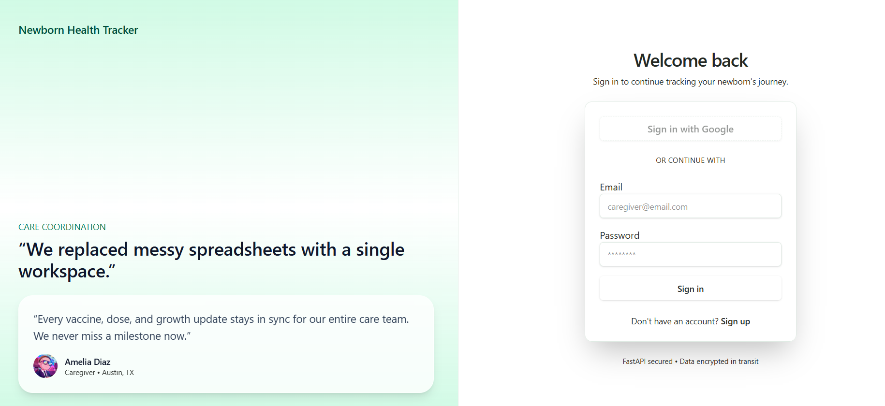
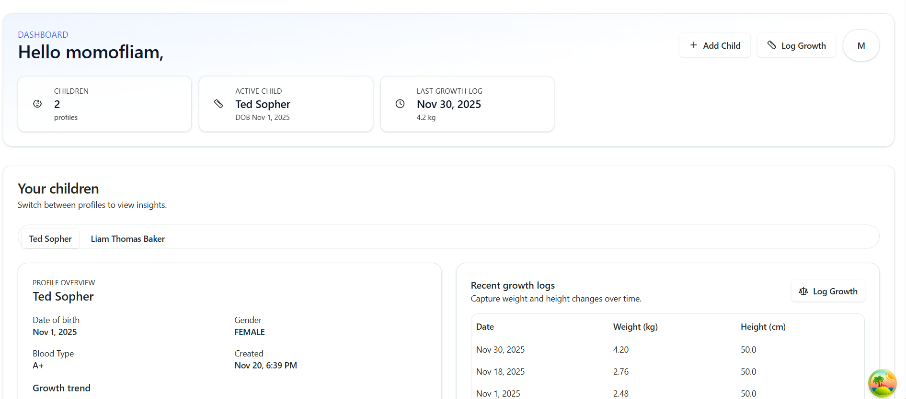
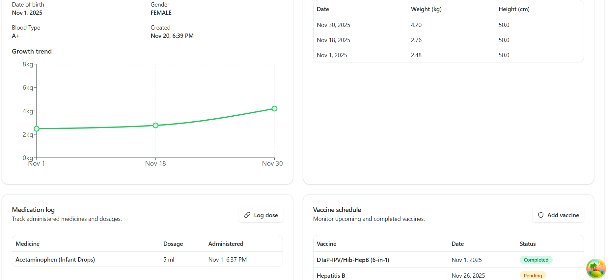

# Newborn Health Tracking Platform
Monitor newborn growth, medications, and vaccination schedules with a FastAPI backend and a Next.js (App Router) frontend using shadcn/ui, TanStack Query, and Google OAuth.

> **Login Page**
> 
> **UI Screen 1**
> 
> **UI Screen 2**
> 


---

## Repository Structure
| Path | Description |
|------|-------------|
| `backend/` | FastAPI service (async SQLAlchemy, Alembic, JWT auth, Docker-ready). See [`backend/README.md`](backend/README.md) for full setup. |
| `frontend/` | Next.js 16 app using shadcn/ui, Tailwind, TanStack Query, Google OAuth, and recharts. See [`frontend/README.md`](frontend/README.md)|

---

## Features
### Backend
- FastAPI 0.111 + async SQLAlchemy with MySQL (via `aiomysql`).
- Auth flows: Google ID token login + email/password (bcrypt + JWT).
- CRUD for children, growth logs, medications, and vaccine schedules defined in the published OpenAPI schema.
- Alembic migrations, pytest scaffolding, Docker Compose workflow, uv-powered dependency management.

### Frontend
- Next.js App Router, strict TypeScript, Tailwind/shadcn tokens with emerald theme.
- Authentication routes inspired by [shadcn blocks](https://ui.shadcn.com/blocks) with Google OAuth integration.
- Dashboard tabs for each child featuring growth charts (recharts), medication logs, vaccine schedules, and add-log dialogs.
- TanStack Query for data fetching/caching, Axios interceptor for bearer tokens, zod + react-hook-form validation, toast feedback via sonner.

---

## Quick Start
### Backend
```bash
cd backend
cp .env.example .env        # configure DB + OAuth secrets
uv sync                     # install dependencies into .venv
uv run alembic upgrade head # apply migrations
uv run uvicorn app.main:app --reload
```
Visit `http://localhost:8000/docs` for OpenAPI docs. See [`backend/README.md`](backend/README.md) for Docker instructions and environment details.

### Frontend
```bash
cd frontend
cp .env.local.example .env.local   # create this file if it doesn't exist
# Required entries
NEXT_PUBLIC_API_BASE_URL=http://localhost:8000
NEXT_PUBLIC_GOOGLE_CLIENT_ID=your-google-oauth-client-id

npm install
npm run dev
```
Navigate to `http://localhost:3000`. You’ll be redirected to `/login` and can explore `/dashboard` after authenticating.
See [`frontend/README.md`](frontend/README.md)

---

## Development Notes
- **Auth tokens** are stored in `localStorage` under `nh-auth`. The Axios interceptor reads from there for every request.
- **Dialogs** (growth, medication, vaccine) live under `frontend/components/dashboard` for reuse.
- **shadcn components** are colocated in `frontend/components/ui/`. Run `npx shadcn@latest add <component>` to scaffold new primitives.
- **TanStack Query keys** follow the pattern `["resource", childId]`; remember to invalidate when adding or mutating data.

---

## Contributions & Roadmap
1. Create a feature branch (e.g., `feature/medication-filters`).
2. Run backend tests (`uv run pytest`) and frontend lint (`npm run lint`) before opening a PR.
3. Planned enhancements:
   - Push notifications or scheduled reminders for vaccines/meds.
   - Editable growth/medication/vaccine entries.
   - Analytics exports + PDF health summaries.

Feedback and issues are welcome. Please include environment details and reproduction steps when reporting bugs.

---

## License
This project is licensed under the [MIT License](LICENSE).
